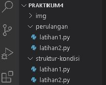
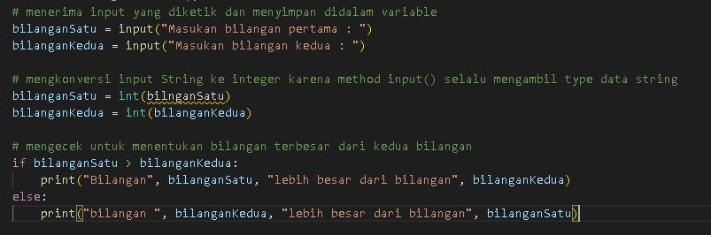
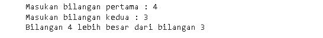
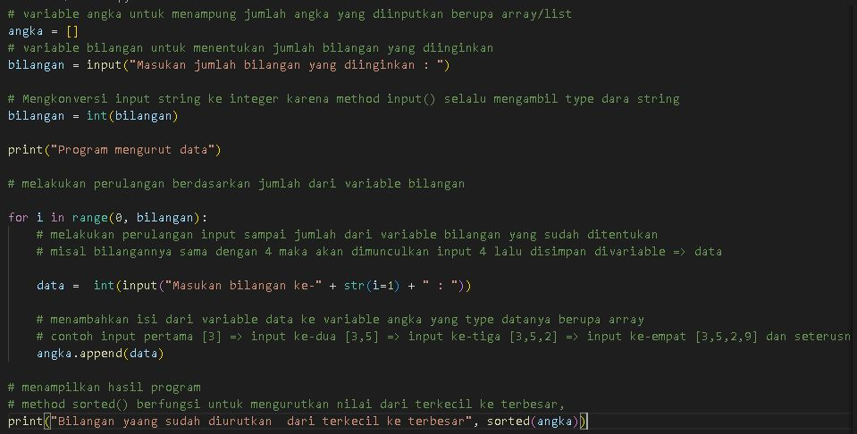
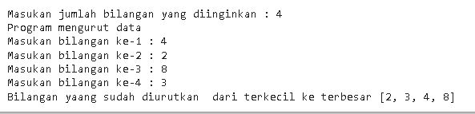
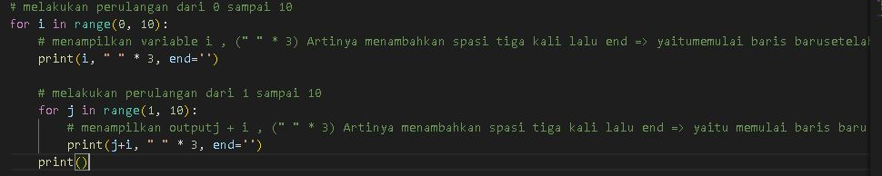
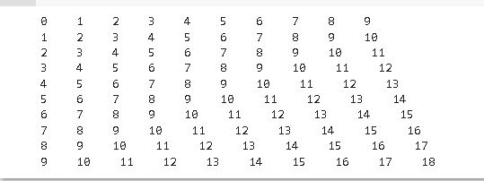

| Nama  | M Muammar |
| ----- | --------- |
| NIM   | 312210663 |
| kelas | TI.22.B1  |

---

## Praktikum 4 Bahasa Pemrograman python

## Belajar Struktur kondisi dan Perulangan pada python

1. Buat folder dengan nama Praktikum4 lalu di dalamnya kita buat dua folder yaitu struktur-kondisi & perulangan dan didalamnya dibuatkan file(file 1 dan file 2). saya beri contoh pakai nama latihan1.py dan latihan2.py

2. selanjutnya kita buka file struktur-kondisi > latihan1.py. Dan tuliskan codingan seperti di bawah ini:

jika sudah silahkan run codingan tersebut akan menghasilkan output seperti dibawah ini:

3. Selanjutnya kita buka latihan2.py pada folder struktur-kondisi lalu tuliskan codingan berikut:

jika sudah silahkan di run dan akan menghasilkan output seperti dibawah ini:

4. Selanjutnya kita buka latihan1.py pada folder perulangan, lalu tuliskan codingan berikut:

jika sudah silahkan di run dan akan menghasilkan output seperti dibawah ini:

5. Selanjutnya kita buka latihan2.py pada folder perulangan, lalu tuliskan codingan berikut:

jika sudah silahkan di run dan akan menghasilkan ouput seperti di bawah ini:

## Kurang lebih seperti itu untuk pembelajaran mengenai struktur kondisi dan perulangan pada bahasa pemrograman python.

_TERIMA KASIH_

